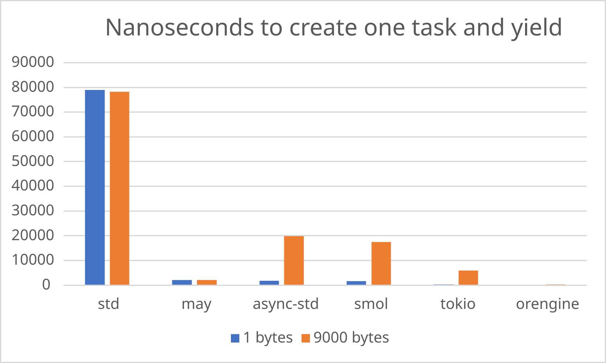
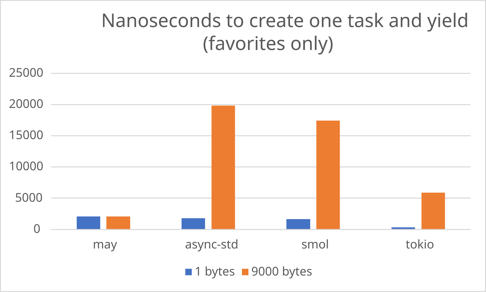
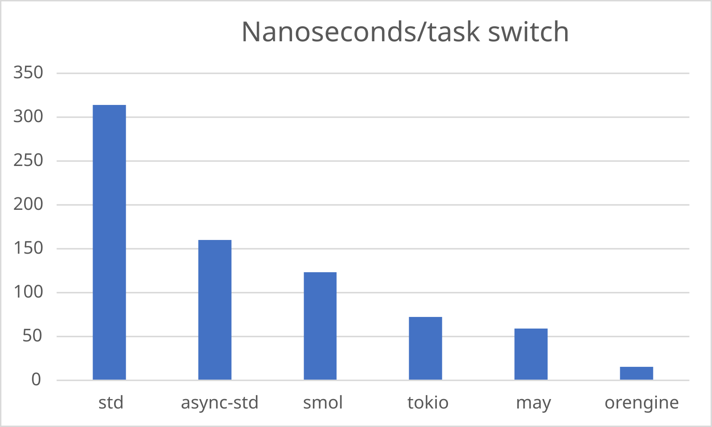
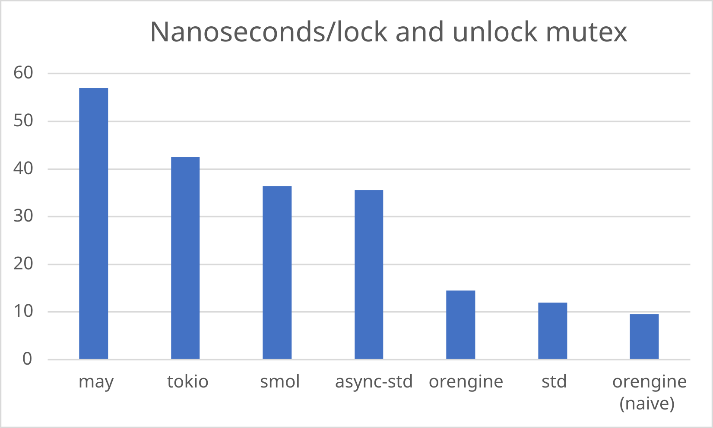
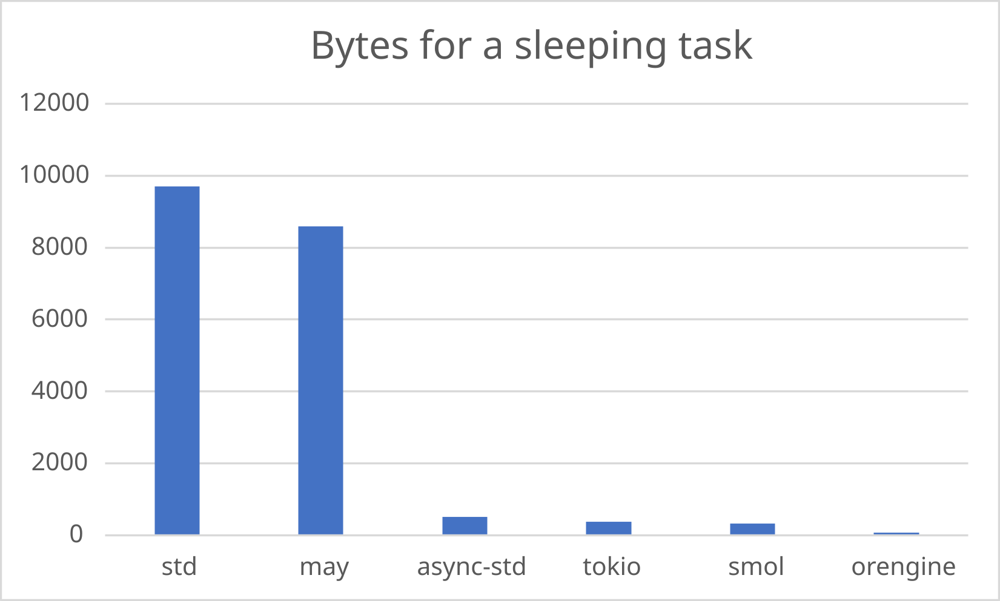
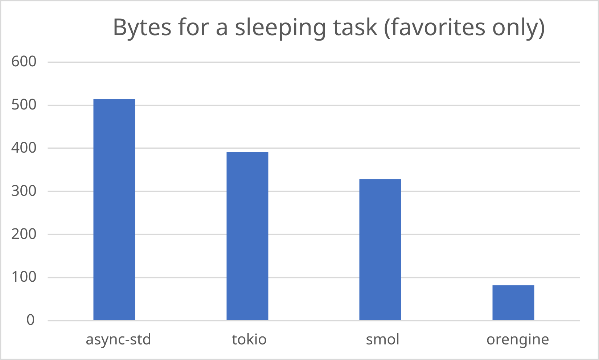

# This directory contains the results of the cpu_bound benchmarks

## Create a task and yield

This benchmark measures the overhead of creating a task, returning from it and yielding.
This shows well how expensive asynchronous abstractions of the engine are.

This test has two options. In the first case, the tasks contain only one number
and return it. In the second case, the tasks contain a buffer that contains
9000 bytes on the stack and return its length.
__Less is better__

__All__

__Favorites only__

## Task switch

This benchmark measures the overhead of switching between tasks.
__Less is better__

## Mutex lock and unlock

This benchmark measures the overhead of locking and unlocking a mutex.
This test shows that an asynchronous Mutex can run just as fast as a
synchronous one. So don't be afraid to use `orengine::sync::Mutex` in your tasks!
__Less is better__

## Memory usage per task

This benchmark measures the memory usage per task.
Because it is sleeping, it stores the task in the sleeping manager with their deadlines.
__Less is better__

__All__

__Favorites only__

