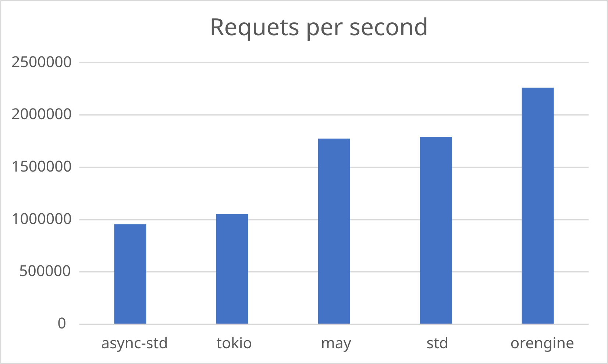

# This directory contains the results of the net/tcp benchmarks

## Echo server

This benchmark measures the TCP echo server throughput. The benchmark below used `std::net` for the client.
For this benchmark a 12-cpu machine was used and only 1024 connections were made.
__More is better__

But these results are for `localhost`, so it can show only _ideal_ case when no packages are lost and the connection
is perfect.
In the real case, __Orengine__ and __May__ show almost the same performance,
but Orengine uses memory much more efficiently.

# Run server

Run a server with one argument with one of the following values:

- `std`
- `async-std`
- `tokio`
- `may`
- `orengine`

Second argument that is the server address (default is `localhost:8083`).

Example command: `cargo run --release orengine localhost:8083`

# Run client

Run the client with one argument with one of the following values:

- `std`
- `async-std`
- `tokio`
- `smol`
- `orengine`

Second argument that is the server address (default is `localhost:8083`).

Third argument that is the number of messages (default is 5.2 million).

Fourth argument that is the number of connections (default is 512).

Example command: `cargo run --release orengine localhost:8083 5200000 512`